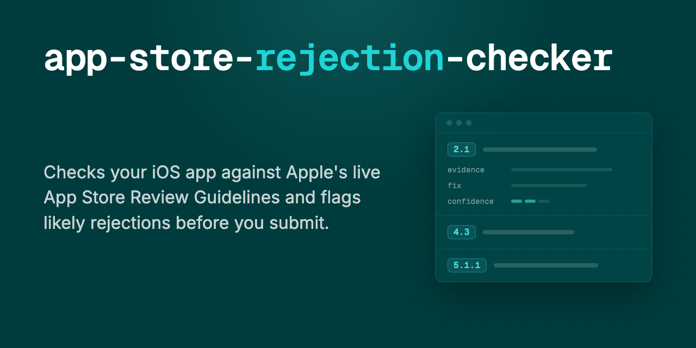

# app-store-rejection-checker

A Claude Code skill that audits your iOS or iPadOS app before App Store submission
and tells you what is likely to get rejected: the guideline number (or the upload
validation it trips), the evidence it found in your repo, a concrete fix, and an
honest confidence level.

- **Live guidelines, not a frozen rule list.** Every audit starts by fetching the
  current App Store Review Guidelines from Apple's site.
- **Static checks** for the mechanical surface: purpose strings vs the APIs you
  actually link, privacy manifest and required-reason declarations, entitlements,
  export compliance, IAP and restore wiring, account deletion, App Tracking
  Transparency, web-wrapper fingerprints.
- **Semantic review** for what mechanical tools cannot judge: does your description
  match what the app does, is it differentiated enough for a saturated category,
  will your review notes and demo account get a reviewer to your core flow, does
  your AI feature get consent before sharing personal data with a third-party
  AI service.
- **Portable.** Written in the open Agent Skills format; Cursor, Codex CLI, and
  Gemini CLI run it too. See [Use with other agents](#use-with-other-agents).

## Install

Paste this into Claude Code or Codex inside your app repo:

```
Install the skill from https://github.com/dabodamjan/app-store-rejection-checker and check this app for App Store rejection risks.
```

The agent fetches the repo and takes it from there. The audit covers more if you
paste your App Store Connect metadata (description, keywords, age rating, review
notes, demo account) when asked; the store listing is a real rejection surface,
not decoration.

**Manual install**, if you want the skill permanently in place:

```bash
git clone https://github.com/dabodamjan/app-store-rejection-checker.git
mkdir -p ~/.claude/skills
cp -R app-store-rejection-checker/skills/app-store-rejection-checker ~/.claude/skills/
```

Then run `/app-store-rejection-checker` in a Claude Code session inside your app
repo. Use `.claude/skills/` instead to install for a single project; the `skills/`
layout is also plugin-compatible.

## Example finding

Every finding in the report looks like this, headed by the guideline number it
cites (or the upload validation it trips):

```
### [5.1.1(v)] Account creation without in-app account deletion
Confidence: review-risk
Evidence: FirebaseAuth in Podfile.lock; SignUpView.swift implements registration;
no account deletion UI or deleteUser call anywhere in Sources/.
Why it matters: "If your app supports account creation, you must also offer account
deletion within the app" (live guideline text). Deactivation-only flows are
explicitly insufficient, and support-email routes are only acceptable in highly
regulated industries. Scaffolded codebases often wire up auth without a delete flow.
Fix: add a delete-account action in settings that removes the Firebase user and all
associated backend records, then re-run this audit.
```

## What it checks

| Area | Examples |
|---|---|
| Completeness signals (2.1) | demo account and review notes quality, placeholder content |
| Metadata accuracy (2.3.x) | description vs actual code, screenshots, name and keyword rules, age rating answers |
| Payments (3.1.x) | digital goods outside IAP, restore purchases, subscription disclosure, loot box odds |
| Minimum functionality (4.2) | web-wrapper fingerprints, thin AI-wrapper patterns |
| Differentiation (4.3) | saturated-category exposure, template output signals |
| Login services (4.8) | social login without a privacy-protecting alternative |
| Privacy (5.1.x) | purpose strings, privacy manifest, account deletion, ATT, third-party AI data sharing |
| Special categories | kids, medical, gambling, VPN, crypto, finance, UGC obligations |
| Recent rule changes | 2024-2026 surfaces: privacy manifests, AI disclosure, age rating overhaul, EU DMA |

Guideline numbers in the bundled references were verified against the live text on
2026-08-20. Each run re-fetches the main guidelines (the authority on any
conflict) and quotes finding-relevant wording from them, scans Apple's news feed
headlines, and fetches auxiliary policy pages (account deletion, EU DMA terms, age
ratings, required-reason APIs) when a finding depends on them.

## Honest limits

- The skill sees your repository, the metadata you share, and the live guidelines.
  It cannot verify runtime behavior (crashes, broken links, restore-purchase flows,
  OAuth round trips, server-driven content); the report lists those as unchecked
  rather than pretending.
- Findings are risk assessments with stated confidence, not verdicts. App Review is
  run by people; no tool can guarantee approval, and this one does not claim to.
- Not affiliated with or endorsed by Apple. App Store, Xcode, and related marks
  belong to Apple Inc.

## Use with other agents

The skill is a `SKILL.md` plus reference files, no code, in the open
[Agent Skills format](https://agentskills.io). Cursor, Codex CLI, and Gemini CLI
support the format natively (agentskills.io lists all adopters): copy
`skills/app-store-rejection-checker/` into whatever directory your agent reads
skills from. Live-page fetches need whatever fetch or browser tool your agent
exposes, and the `allowed-tools` frontmatter field is spec-experimental, so
support may vary. Agents without native skill support can be pointed at the
`SKILL.md` and asked to follow it.

## Prior art

Good tools already exist here: [fastlane precheck](https://docs.fastlane.tools/actions/check_app_store_metadata/)
(text-pattern rules over App Store Connect metadata),
[greenlight](https://github.com/RevylAI/greenlight) (the strongest mechanical
checker I found: an offline Go CLI plus a Revyl-backed tier that runs key flows on
cloud simulators), [berkayturk/appstore-precheck](https://github.com/berkayturk/appstore-precheck)
(static checks plus LLM analysis with an eval harness), and the skill sets
[cruisediary/apple-app-review-skills](https://github.com/cruisediary/apple-app-review-skills)
and [dpearson2699/swift-ios-skills](https://github.com/dpearson2699/swift-ios-skills)
(the latter under the source-available PolyForm Perimeter license).

What this one does differently: live guidelines at run time instead of a frozen
rule list, semantic review of your real code and store copy rather than pattern
matching alone, reference data limited to the only frequency numbers Apple
publishes plus a confidence-labeled ranking, and an MIT license.

## Who made this

I am [Damjan Dabo](https://dabo.dev), an indie iOS developer in Croatia. I have
been shipping my own apps on the App Store since 2022 ([Itemlist](https://getitemlist.app),
[QRGenie](https://qrgenie.app), [BarcodeCraft](https://barcodecraft.com)); this
skill distills what those submissions taught me, built and reviewed with Claude
Code and Codex. I write about building
iOS apps and working with AI tooling at [dabo.dev](https://dabo.dev), and I am on
[LinkedIn](https://www.linkedin.com/in/damjan-dabo/) and
[X](https://x.com/DamjanDabo).

Found a check that is wrong or missing? Issues and PRs are welcome. If this saved
you a rejection, a star helps others find it.

## License

MIT. See [LICENSE](LICENSE).
